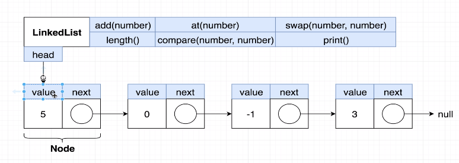
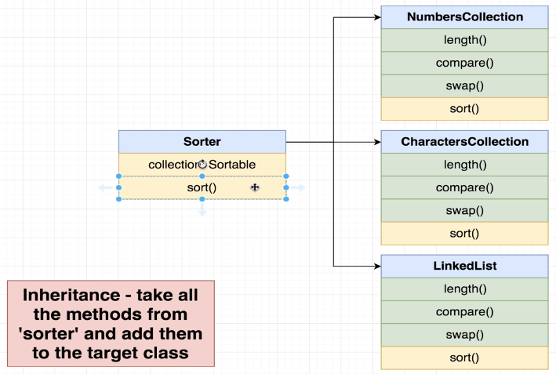

## How to run Typescript using Typescript Compiler?

| Command                 | Definiton                                                   |
| ----------------------- | ----------------------------------------------------------- |
| **npm i typescript -g** | Install Typescript as global variable in your local machine |
| **tsc --init**          | Generate tsconfig.json                                      |
| **tsc** or **tsc -w**   | Compiles Typescript code into Javascript code               |

## How a Linked List is structured in our code to better familiarize it



- Our head contains a value (can be any arbitrary value) that is type **number** and it will have a reference to the next node of our chain until to the very last node and this last node will have a **null** as its next node that means its the end

## Inheritance

Take all the methods from 'sorter' amd add them to the target class


This is convenient in a way that instead of calling 'length', 'compare', 'swap', and 'sort' function, we will have a centralized function that we can call.

```javascript
// So instead of using 'sort()',
const numbersCollection = new NumbersCollection([10, 3, -5, 0]);
const sorter = new Sorter(numbersCollection);
sorter.sort();
console.log(numbersCollection.data);

const charactersCollection = new CharactersCollection("Xaayb");
const sorterCharacters = new Sorter(charactersCollection);
sorterCharacters.sort();
console.log(charactersCollection.data);
```

## Abstract Classes

- Can't be used to create an object directly
- Only used as a parent class
- Can only contain real implementation for some methods
- The implemented methods can refer to other methods that don't actually exist yet (we still have to provide names and types for the un-implemented methods)
- Can make child classes promise to implement some other method

### Note: We are not using Interfaces on this project anymore

### Interfaces vs Abstract Classes

----------- | ---------
Interfaces | Sets up a contract between different classes
| use when we have a very different objects that we want to work together
| Promotes loose coupling
Inheritance/ Abstract Classes | Sets up a contract between different classes
| Use when we are tryng to build up a defintion of an object
| Strongly couples classes together
